<!-- PROJECT LOGO -->
<br />
<p align="center">

  <h3 align="center"> PoliceBot - An Chatbot for policemen for crime registration, awareness, emergency alert, tracking and readdressal </h3>

  <p align="center">
    A Chatbot PWA
    <br />
    <a href="https://github.com/rampa2510/policebot"><strong> Explore the docs » </strong></a>
    <br />
    <br />
    ·
    <a href="https://github.com/rampa2510/policebot/issues">Report Bug</a>
    ·
    <a href="https://github.com/rampa2510/policebot/issues">Request Feature</a>
  </p>
</p>


<!-- TABLE OF CONTENTS -->
## Table of Contents

- [Table of Contents](#table-of-contents)
- [About The Project](#about-the-project)
  - [Technologies used](#technologies-used)
- [Getting Started](#getting-started)
  - [Prerequisites](#prerequisites)
- [Features](#features)
- [Contributing](#contributing)
- [License](#license)


<!-- ABOUT THE PROJECT -->
## About The Project

The main idea of this product is as follows - 
  - This app has 2 users one is the policemen and the other is citizen
  - Citizen can register crime by chatting with the users, track thier register case, fire a emergency alert, get safety tips from chatbot
  - Citizen can press the button on the navbar multiple times to register a crime
  - When a user registers a case he will get a whatsapp notification with the case number and the status of the case
  - The user can provide photos for a case  
  - If a user fires an emergency alert, nearby policmen will get the update about it on thier whatsapp number
  - Citizen can see all the cases alongwith updates from the policemen in the second tab available to him "My cases"
  - The citizen also has the speech to text feature available for the chatbot where if he says emergency the user need not to press the enter button it will fire an emergency otherwise he will have to press enter for other messages
  - The policemen can see the pending case. He can then start the investigation of the case, mark spam. If a specific users cases gets marked as spam 3 times, the system will block the user from being logged in for 5 days
  - If the policemen starts a investigation the citizen  that registerd that case will get a whatsapp message about the status update with the officer name
  - The policemen can send updates from the case dashboard to the recivers whatsapp number.
  - The policemen can even transfer the case to another policemen
  - When the case is completed the policmen can mark the case as complete and the user will get the whatsapp message with the status update
### Technologies used

* [react](https://reactjs.org/)
* [nodejs](https://nodejs.org/en/)
* [Dialgflow](https://dialogflow.com/)
* [AWS S3](https://s3.console.aws.amazon.com/)


<!-- GETTING STARTED -->
## Getting Started

1. Clone the repo 
2. Install all the packages in the package.json file 
3. Make a twilio,s3,location iQ account and add the api key wherever it is required 
4. Run the command   To start the app in development server
  ```
  npm start
  ```


5. For building the production 

  ```
 npm run build
  ```

### Prerequisites
1. Install react,nodejs


<!-- USAGE EXAMPLES -->
## Features
1. When you first open the app you will see login page where you can login or register 
  
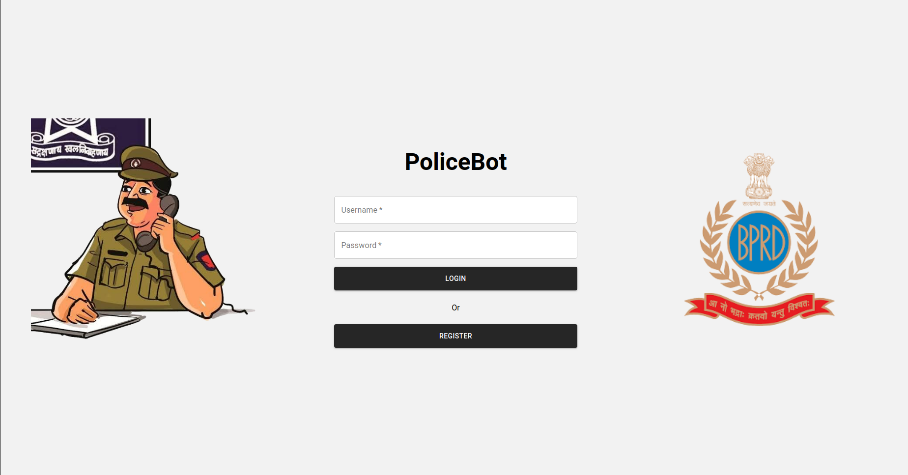
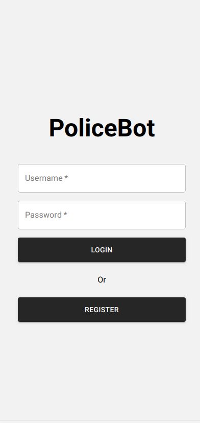

1. If you have previously had a account you can register a new account by clicking on the register button where you can enter details and you will be redirected to the otp page which will be sent to your mobile number
   
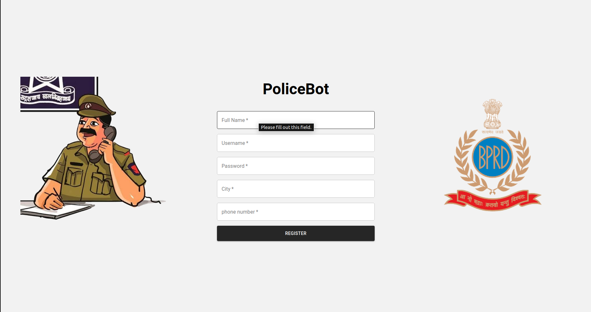
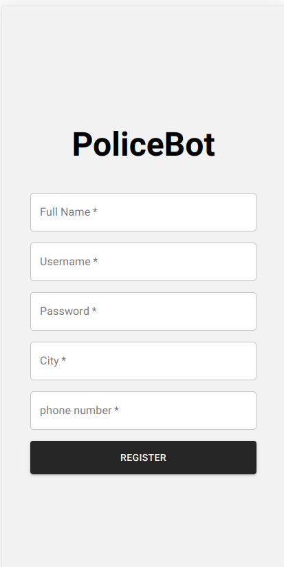


1. If you have been logged in you will be directed towards the main screen depending on the user type if you are 
  - Citizen you will see the chatbot where you can perform all the [mentioned](#about-the-project) opertaions for the user
    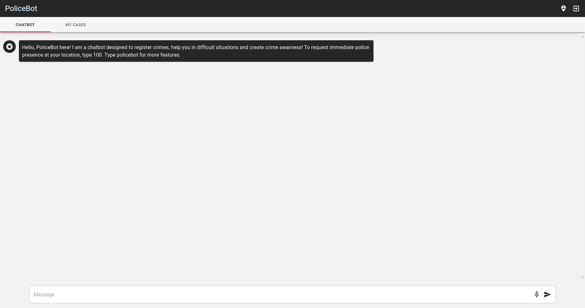
    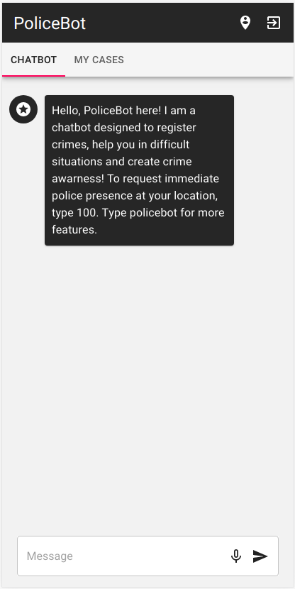
  - Citizen can also view all the cases registered by him in the my cases tab
    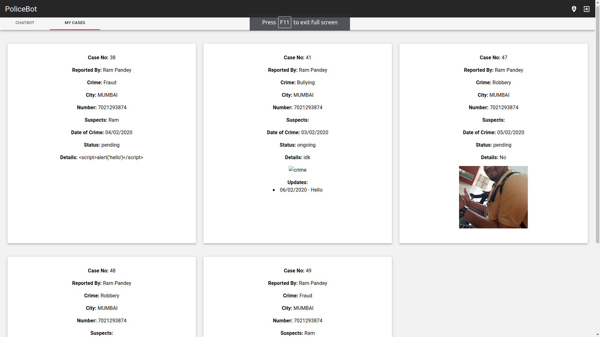
    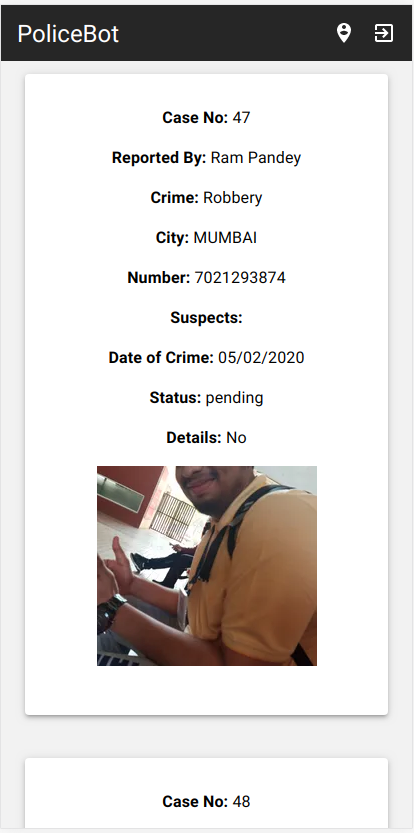
  - Citizen can fire emergency alert by pressing the icon on the navbar multiple times
  - If You have logged in as a policemen you can see all the fetures [mentioned](#about-the-project) here
    - Emergency Tab for policemen
      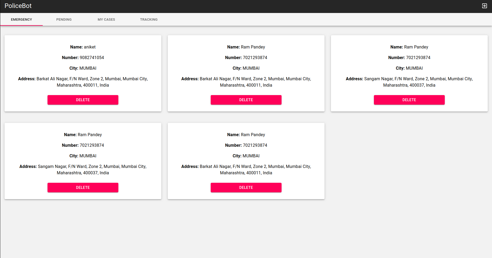
      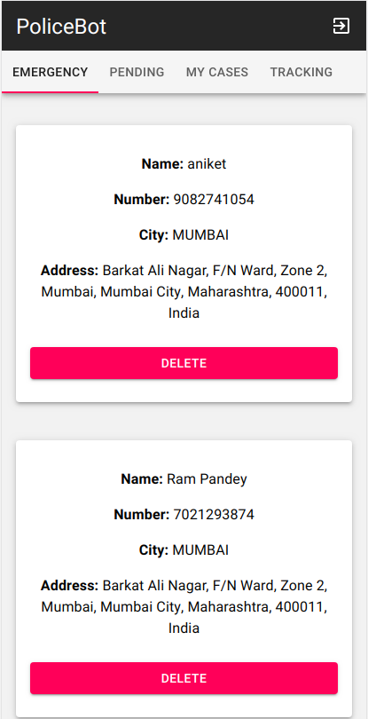
    - Pending cases Tab for policemen
      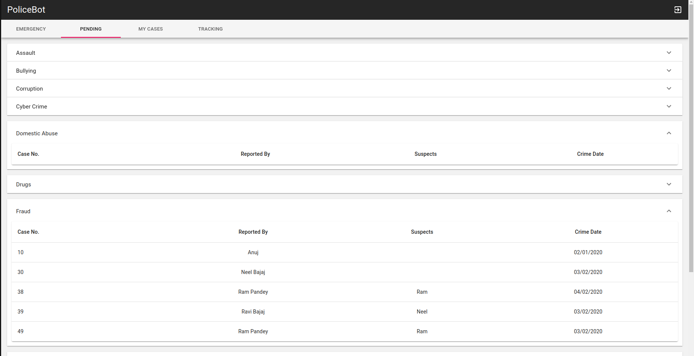
      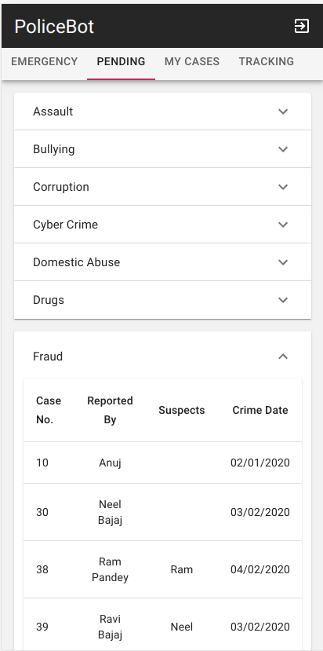
    - When  the police clicks on a pending case he will be redirected to a new page with more details
        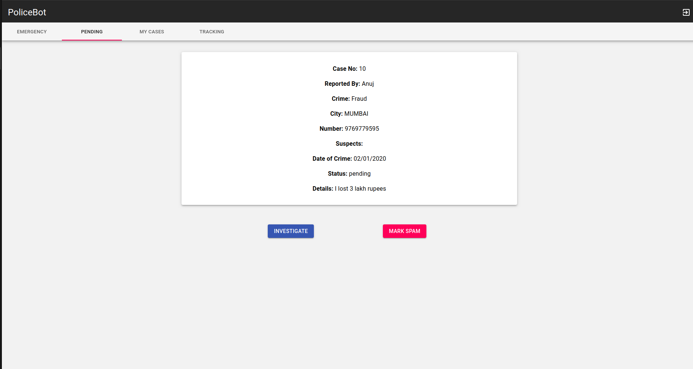
        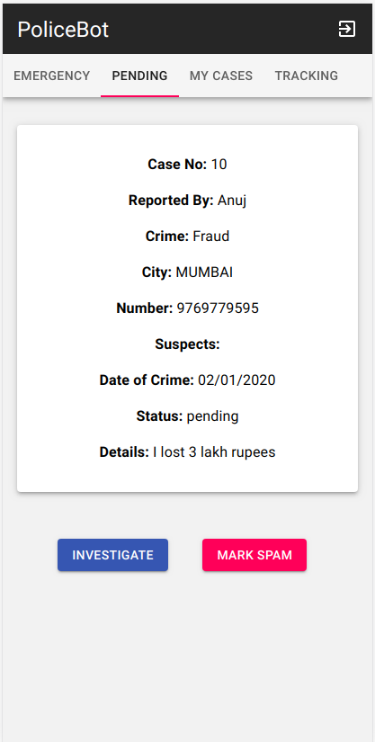
    - Policemen my cases tab 
        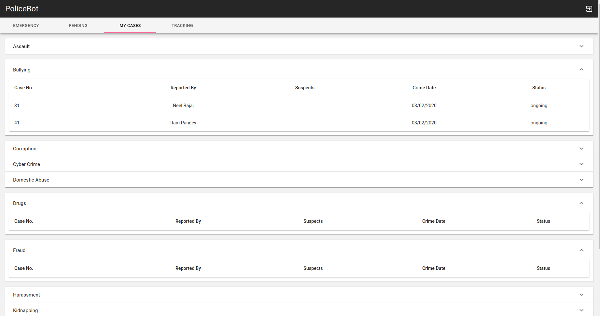
        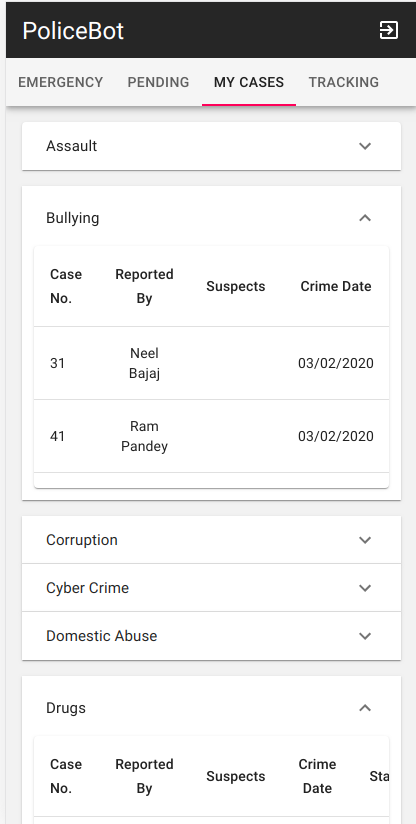
    - When a policemen clicks on a case he will see the case dashboard
        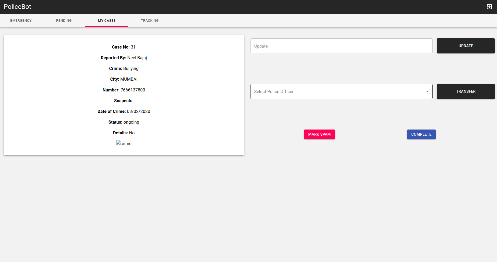 
        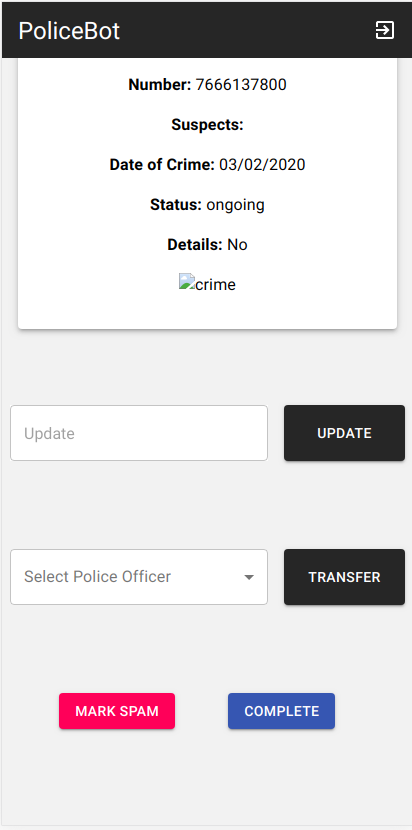 
    - Policemen can track any case with the track tab
        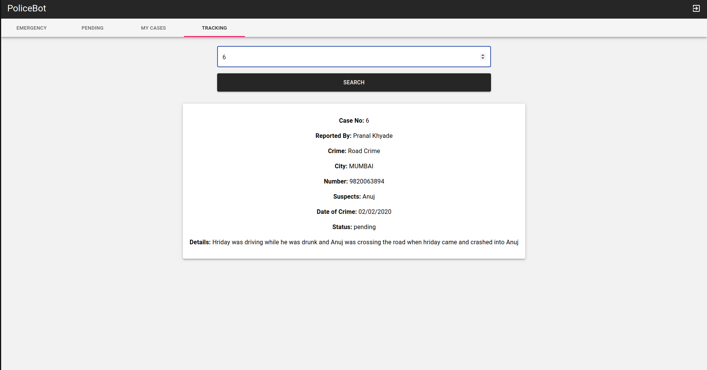  
        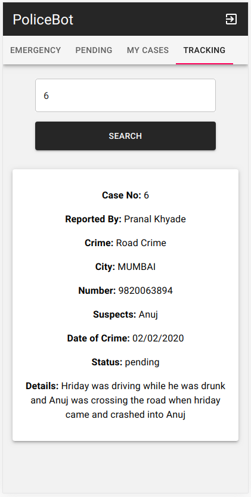  
<!-- CONTRIBUTING -->
## Contributing

Contributions are what make the open source community such an amazing place to be learn, inspire, and create. Any contributions you make are **greatly appreciated**.

1. Fork the Project
2. Create your Feature Branch (`git checkout -b feature/AmazingFeature`)
3. Commit your Changes (`git commit -m 'Add some AmazingFeature'`)
4. Push to the Branch (`git push origin feature/AmazingFeature`)
5. Open a Pull Request


<!-- LICENSE -->
## License

Distributed under the MIT License. See `LICENSE` for more information.


 [](https://www.linkedin.com/in/rampa2510) [](https://www.github.com/rampa2510) 
